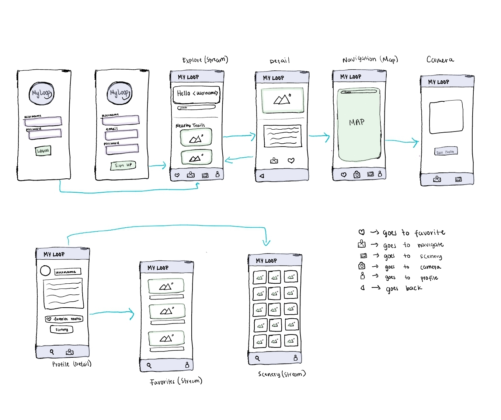
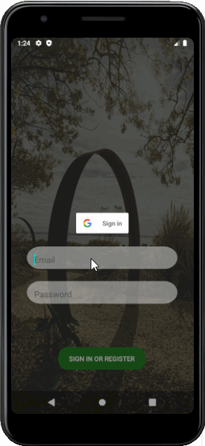
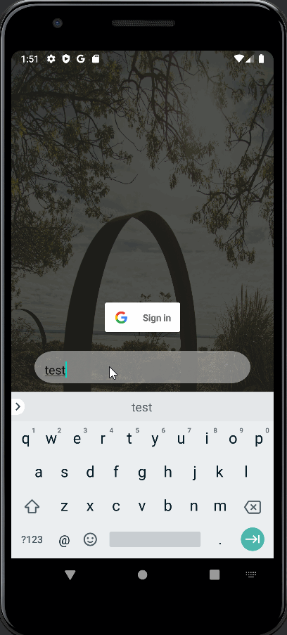
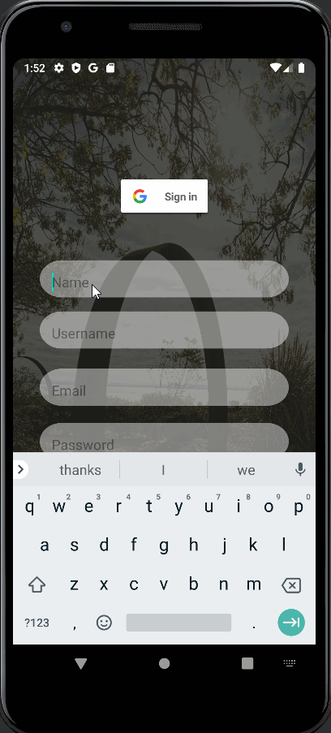
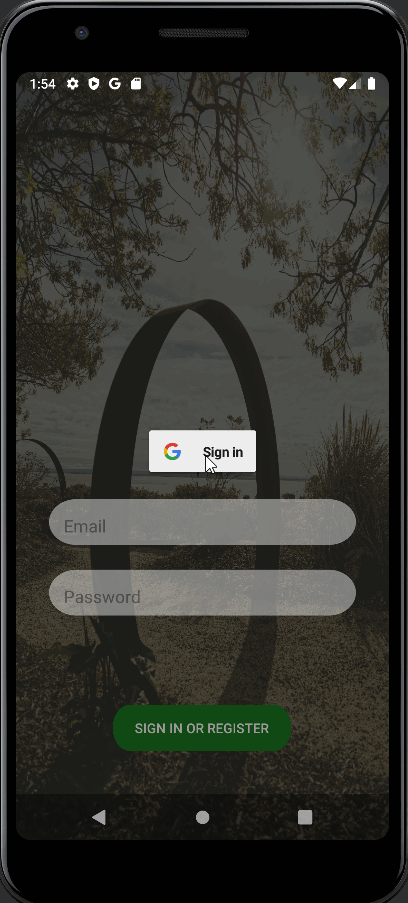

# MyLoop

## Table of Contents
1. [Overview](#Overview)
1. [Product Spec](#Product-Spec)
1. [Wireframes](#Wireframes)
2. [Schema](#Schema)

## Overview
### Description
This app helps users to find a path of specified length that starts and ends at the same position.

### App Evaluation

- **Category:** Health and Fitness
- **Mobile:** Uses maps and location features that allows users to find loop paths. It also has a camera that is used to capture and share scenery.
- **Story:** Say you are in a new town or unfamiliar place and you want to find a cycling/ jogging path of a certain length, would not it be nice to find a cyclic path? This app will help the user to find his/her desired path to enjoy.
- **Market:** Anyone who likes to run, jog, walk or cycle would enjoy this app. If a user enjoys discovering new places and wants to explore new paths via a loop this app will be perfect.
- **Habit:** Users will check for new paths/trails daily. Users can explore endless new trails and take as many photos as they wish. 
- **Scope:** Given that we have to interact with Strava API's and work with GPS navigation, this app will be quite challenging to implement. However, a stripped down version of this app is nonetheless interesting to build. The app will start out by just allowing the user to log in and out of the app, find a trail then based on desired length, find a path that begins and end in the same position. 

## Product Spec

### 1. User Stories (Required and Optional)

**Required Must-have Stories**

- [X] User can sign up for a new account
- [X] User can login
  - [X] User can log in with username and password
  - [X] User can log in with Google account
- [X] User can logout
- [ ] User can search for a trail
- [ ] User can view detailed information about a trail
- [ ] User can get a path on the trail which has the same start and destination (Cyclic path)
- [ ] User can select the desired length of the path

**Optional Nice-to-have Stories**

* Keep track of path completed (competition)
* Draw a desired path on the map and save it
* Favorite a path
* Suggest trails based on favorites
* Show top rated nearby paths 
* User can take a photo of the scenery 
* User can view all photos taken
* Count calories
* Leaderboards
* Trail Ranks (based on scenery, convenience, number of people completed the path)
* Weather forecast

### 2. Screen Archetypes

#### Required Stories
* Login Screen
   * user should be able to login
* Register Screen
   * user create or login to their account
* Stream - Explore Screen
   * shows suggested trails
   * user can search for a trail/path
   * user can favorite a trail or path
* Detail Screen
   * user can view detailed information about the selected path or trail 
* Map - Navigation Screen
   * user can search for a trail
   * user can use a map to navigate to the selected trail or path

#### Stretch Stories
* Creation - Capture Screen
   * user can take a photo of a path/scenery 
* Profile Screen
   * user can view profile information
   * health profile (includes calories burnt, total length traveled)
* Stream - Favorites Screen
   * user can view a list of all his/her favorite trails
* Stream - Scenery Screen
   * user can view a gallery of photos taken

### 3. Navigation

**Tab Navigation** (Tab to Screen)

* Explore
* Navigate
* Camera
* Profile
* Favorites
* Scenery

**Flow Navigation** (Screen to Screen)

* Login Screen
   * Explore Screen
* Register Screen
   * Explore Screen
* Explore Screen
   * Detail Screen
   * Profile Screen
   * Navigation Screen
   * Favorites Screen
   * Scenery Screen
* Detail Screen
   * Navigation Screen
   * Explore Screen
* Navigation Screen
   * Capture Screen
   * Favorites Screen
   * Scenery Screen
* Capture Screen
   * Scenery Screen 
   * Navigation Screen
* Profile Screen
   * Explore Screen 
   * Navigation Screen
   * Favorites Screen
   * Scenery Screen

## Wireframes


### [BONUS] Digital Wireframes & Mockups


### [BONUS] Interactive Prototype

GIF created with [LiceCap](http://www.cockos.com/licecap/).

## Schema 
### Models
  #### User
  
  | Property  | Type  | Description |
  | --------- | ----- | ----------- |
  | userID    | String | unique id for a user |
  | username  | Pointer to user | name of the user |
  | image     | File  | user's profile image |
  | scenery   | File  | images of scenes captured by the user |
  | favoriteRoutes | Array of Image Objects | list of the user's favorite routes |
  
  #### Trail
  
  | Property  | Type  | Description |
  | --------- | ----- | ----------- |
  | trailID   | String | unique id for a trail |
  | name      | String | name of the trail |
  | image     | File  | picture of a trail |
  | description | String | detailed overview of the trail |
  | location  | Array of Floats     | longtitude and latitude of a trail |
  | scenery   | Array of Images     | images related to a specific trail |


### Networking

#### List of network requests by screen
- LogIn Screen
    - (Read/GET) : query for a specified user
```
ParseUser.logInInBackground(username, password, new LogInCallback() {
            @Override
            public void done(ParseUser user, ParseException e) {
                if (e != null) {
                    Log.e(TAG, "Issues with login", e);
                }
                goMainActivity();   // starts a new activity if user is logged in
            }
        });
```
- Home Screen 
    - (Read/GET) : query for a specified or nearby path
- Detail Screen
    - (Read/GET) using trail_id get the list of scenery
- Navigate Screen 
    - (Read/GET) retrieve the user's desired path
- Capture Screen 
    - (Create/POST) user posts a captured scenery to his/her account
- Profile Screen 
    - (Read/GET) get user information (profile picture, fav. routes)
- Scenery Screen 
    - (Read/GET) retrieve pictures the user took

- [Create basic snippets for each Parse network request]

- [OPTIONAL: List endpoints if using existing API such as Yelp]

### App Walkthough GIF
  ##### Login Screen
<br> 

 ##### Logout
<br> 

 ##### Register Screen
<br> 

 ##### Login with Google Account
<br> 

GIF created with [LiceCap](http://www.cockos.com/licecap/).
